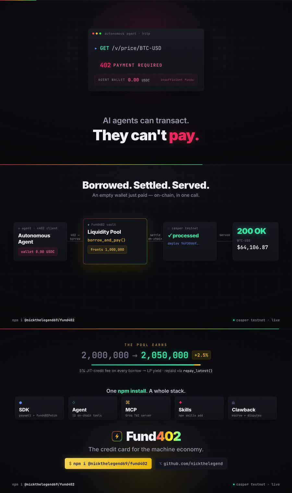

# Fund402 — 45-second product demo

A premium, technical product film for Fund402: the problem → the SDK → the live
on-chain flow → LP yield → the whole ecosystem.

**▶ [`fund402-promo.mp4`](./fund402-promo.mp4)** · 1920×1080 · 45s · H.264 + music



## What it shows

| Beat | Time | Content |
|---|---|---|
| **The problem** | 0–7.5s | An autonomous agent hits `402 Payment Required` with a `0.00 USDC` wallet — *"AI agents can transact. They can't pay."* |
| **The reveal** | 7.5–15.5s | `Fund402` — *just-in-time credit + x402 settlement on Casper* · `npm i @nickthelegend69/fund402` |
| **The code** | 15.5–25s | The real API — server `paywall()` + client `fund402Fetch()`, side by side |
| **Live proof** | 25–35.5s | The on-chain pipeline: agent → 402 → the vault fronts the payment → settled on Casper → `200 OK`, with the real settlement receipt (`deploy 96f30ddf…`, `status processed`) |
| **Yield + stack** | 35.5–45s | The pool earns (`2,000,000 → 2,050,000`, +2.5% via `repay_latest()`) · the ecosystem — SDK · Agent · MCP · Skills · Clawback · CTA |

Every number and deploy hash on screen is real — see [DEPLOYMENT.md](../DEPLOYMENT.md)
and [STATUS.md](../STATUS.md).

## How it was built

The film is a [HyperFrames](https://hyperframes.heygen.com) composition — **video
rendered from HTML**. Each scene is a self-contained HTML file with a seekable GSAP
timeline; the framework captures the 45s timeline headlessly and encodes it.

```
source/
  index.html               # master assembly — 5 scenes + persistent chrome (progress bar, tags)
  compositions/
    scene1-hook.html        # the 402 problem
    scene2-reveal.html      # the Fund402 reveal + npm install
    scene3-code.html        # paywall() + fund402Fetch()
    scene4-flow.html        # the live on-chain flow + receipt
    scene5-cta.html         # yield + ecosystem + CTA
  assets/bgm/track.mp3      # background score (HeyGen music library)
  STORYBOARD.md             # brief + music mood
```

Rebuild it:

```bash
cd source
npx hyperframes lint && npx hyperframes validate   # check the composition
npx hyperframes render --quality high --output video.mp4
# then mux the music bed (looped to 45s, fades):
ffmpeg -y -stream_loop -1 -i assets/bgm/track.mp3 -t 45 \
  -af "afade=t=in:st=0:d=0.6,afade=t=out:st=43:d=2,volume=0.82" bgm.m4a
ffmpeg -y -i video.mp4 -i bgm.m4a -map 0:v -map 1:a -c:v copy -c:a aac -shortest fund402-promo.mp4
```

Design system: near-black `#07070b`, Inter + JetBrains Mono, accents red `#ff3b5c` /
teal `#25d3a6` / gold `#f5b301` / blue `#5b8cff`. Dark, technical, developer-grade.
